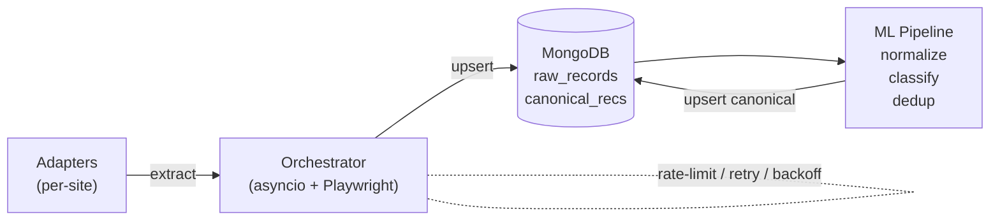

# Public Procurement & Contract Intelligence Collector

Collects public contracting opportunities and award notices from multiple official procurement portals, normalizes them into a unified schema, deduplicates across sources, and classifies opportunities by category.

## Architecture



## Quick Start

### Prerequisites

- [uv](https://docs.astral.sh/uv/) (Python package manager)
- Python 3.11+ (auto-installed by uv if needed)
- MongoDB (local or Docker)
- (Optional) Redis for distributed worker queue

### Setup

```bash
# Clone & install
git clone <repo-url> && cd contract-collector
uv sync

# Install Playwright browsers
uv run playwright install --with-deps chromium

# Copy env config
cp .env.example .env

# Start MongoDB (via Docker)
docker compose up -d mongo
```

### Usage

```bash
# List available adapters
uv run collector list-adapters

# Run collection (all adapters)
uv run collector collect

# Run specific adapters
uv run collector collect -a sam_gov -a nyc_procurement

# Run ML processing pipeline
uv run collector process

# Train the category classifier
uv run collector train-classifier
```

### Docker

```bash
# Full stack (MongoDB + collector)
docker compose up

# With ML processor
docker compose --profile ml up
```

## Project Structure

```
src/collector/
├── __init__.py
├── cli.py                 # Click CLI entry point
├── orchestrator.py        # Async orchestrator with concurrency & rate-limiting
├── core/
│   ├── config.py          # Pydantic settings (env-based)
│   ├── logging.py         # Structured JSON logging (structlog)
│   └── schemas.py         # RawRecord + CanonicalRecord Pydantic models
├── adapters/
│   ├── base.py            # Abstract BaseAdapter
│   ├── registry.py        # Auto-discovery registry + @register_adapter decorator
│   ├── sam_gov.py         # SAM.gov federal procurement adapter
│   └── nyc_procurement.py # NYC PASSPort adapter
├── storage/
│   └── mongo.py           # Async MongoDB (motor) with upsert/dedup logic
└── ml/
    ├── normalizer.py      # Vendor names, dates, currency normalization
    ├── dedup.py           # TF-IDF + cosine similarity duplicate detection
    ├── classifier.py      # scikit-learn category classifier
    └── pipeline.py        # End-to-end: normalize → classify → dedup → upsert
```

## Adding a New Adapter

1. Create `src/collector/adapters/your_portal.py`
2. Subclass `BaseAdapter` and implement `extract(page) -> AsyncIterator[RawRecord]`
3. Decorate with `@register_adapter`
4. Import it in `cli.py` where adapters are loaded
5. Add tests in `tests/adapters/`

```python
from collector.adapters.base import AdapterMeta, BaseAdapter
from collector.adapters.registry import register_adapter

@register_adapter
class YourPortalAdapter(BaseAdapter):
    meta = AdapterMeta(
        name="your_portal",
        base_url="https://procurement.example.gov",
        description="Example procurement portal",
    )

    async def extract(self, page):
        # Navigate, paginate, extract...
        yield RawRecord(...)
```

## Key Design Decisions

- **Adapter-per-source pattern**: Each portal has isolated extraction logic with its own selectors and pagination strategy
- **Checkpointing**: The orchestrator resumes from the last-seen `source_id` to avoid re-processing
- **Content hashing**: SHA-256 of extracted data prevents duplicate upserts; version numbers track changes
- **Structured logging**: JSON logs with structlog for easy parsing and monitoring
- **Rate limiting**: Per-domain `AsyncLimiter` + bounded `Semaphore` for concurrency control
- **Retry with backoff**: Tenacity-based exponential backoff on navigation failures

## Testing

```bash
uv run pytest                        # all tests
uv run pytest tests/ml/              # ML tests only
uv run pytest --cov=collector        # with coverage
```

## CI/CD

GitHub Actions workflow runs daily at 06:00 UTC:

1. Spins up MongoDB service
2. Installs deps + Playwright
3. Runs `collector collect`
4. Runs `collector process`
5. Uploads logs as artifacts

## License

MIT
