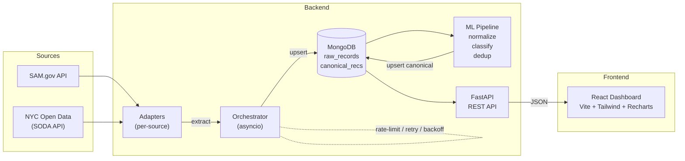

# Public Procurement & Contract Intelligence Collector

Collects public contracting opportunities and award notices from multiple procurement sources, normalizes them into a unified schema, deduplicates across sources, classifies opportunities by category, and presents the results in an interactive dashboard.

## Architecture



## Adapters

| Adapter           | Source                                                               | Type     | API Key Required |
| ----------------- | -------------------------------------------------------------------- | -------- | ---------------- |
| `sam_gov`         | [SAM.gov Opportunities API](https://api.sam.gov)                     | REST API | Yes (free)       |
| `nyc_procurement` | [NYC Open Data](https://data.cityofnewyork.us) (dataset `3khw-qi8f`) | SODA API | No               |

Both adapters are API-based (`requires_browser=False`) and use `httpx` — no Playwright browser required for data collection.

## Quick Start

### Prerequisites

- [uv](https://docs.astral.sh/uv/) (Python package manager)
- Python 3.11+ (auto-installed by uv if needed)
- Node.js 20+ (for the dashboard)
- MongoDB (local or Docker)
- (Optional) Redis for distributed worker queue

### Setup

```bash
# Clone & install
git clone <repo-url> && cd contract-collector
uv sync

# Install Playwright browsers (only needed if adding browser-based adapters)
uv run playwright install --with-deps chromium

# Copy env config
cp .env.example .env
# Edit .env — add your SAM.gov API key (COLLECTOR_SAM_GOV_API_KEY)

# Start MongoDB (via Docker)
docker compose up -d mongo

# Install dashboard dependencies
cd dashboard && npm install && cd ..
```

### CLI Commands

```bash
# List available adapters
uv run collector list-adapters

# Run collection (all adapters)
uv run collector collect

# Run specific adapters
uv run collector collect -a sam_gov -a nyc_procurement

# Run ML processing pipeline
uv run collector process

# Train the category classifier
uv run collector train-classifier

# Start the REST API server
uv run collector serve                     # default: 0.0.0.0:8000
uv run collector serve -p 8080 --reload    # custom port + live reload
```

### Local Development

```bash
# Terminal 1 — MongoDB
docker compose up -d mongo

# Terminal 2 — API server (with live reload)
uv run collector serve --reload

# Terminal 3 — Dashboard dev server (Vite, hot-reload)
cd dashboard && npm run dev
```

Open **http://localhost:5173** — the Vite dev server proxies `/api/*` requests to the FastAPI backend on port 8000.

### Docker (Full Stack)

```bash
# Mongo + API + Dashboard
docker compose up --build

# Include the ML processor
docker compose --profile ml up --build
```

| Service     | Port  | Description                               |
| ----------- | ----- | ----------------------------------------- |
| `mongo`     | 27017 | MongoDB 7                                 |
| `redis`     | 6379  | Redis 7 (optional)                        |
| `api`       | 8000  | FastAPI REST API                          |
| `dashboard` | 3000  | React dashboard (nginx)                   |
| `collector` | —     | Runs `collect` then exits                 |
| `processor` | —     | Runs `process` then exits (profile: `ml`) |

## Dashboard

The dashboard is a React SPA built with **Vite**, **Tailwind CSS v4**, and **Recharts**. It provides:

- **Stat cards** — raw record count, canonical record count, active sources, classified categories
- **Timeline chart** — records collected per day (area chart)
- **Category breakdown** — donut chart of ML-classified categories
- **Source breakdown** — horizontal bar chart of records per adapter
- **Records table** — paginated, searchable, filterable by source/category/status with external links to original postings

## REST API

The FastAPI backend exposes the following endpoints:

| Method | Path                     | Description                                                                                         |
| ------ | ------------------------ | --------------------------------------------------------------------------------------------------- |
| `GET`  | `/api/health`            | Liveness check                                                                                      |
| `GET`  | `/api/stats`             | Summary counts, category/source/status breakdowns, daily timeline                                   |
| `GET`  | `/api/records/raw`       | Paginated raw records (`?source=`, `?limit=`, `?skip=`)                                             |
| `GET`  | `/api/records/canonical` | Paginated canonical records (`?search=`, `?source=`, `?category=`, `?status=`, `?limit=`, `?skip=`) |
| `GET`  | `/api/sources`           | Distinct source names with counts                                                                   |

Interactive docs available at **http://localhost:8000/docs** (Swagger UI) when the API is running.

## Project Structure

```
src/collector/
├── cli.py                 # Click CLI (collect, process, train-classifier, serve)
├── orchestrator.py        # Async orchestrator with concurrency & rate-limiting
├── core/
│   ├── config.py          # Pydantic settings (env-based, COLLECTOR_ prefix)
│   ├── logging.py         # structlog — rich console (local) / JSON (prod)
│   └── schemas.py         # RawRecord + CanonicalRecord Pydantic models
├── adapters/
│   ├── base.py            # Abstract BaseAdapter (browser + API support)
│   ├── registry.py        # @register_adapter decorator + get_adapter()
│   ├── sam_gov.py         # SAM.gov Opportunities API adapter
│   └── nyc_procurement.py # NYC Open Data SODA API adapter
├── api/
│   └── app.py             # FastAPI REST API for the dashboard
├── storage/
│   └── mongo.py           # Async MongoDB (motor) with upsert/dedup logic
└── ml/
    ├── normalizer.py      # Vendor names, dates, currency normalization
    ├── dedup.py           # TF-IDF + cosine similarity duplicate detection
    ├── classifier.py      # scikit-learn category classifier
    └── pipeline.py        # End-to-end: normalize → classify → dedup → upsert

dashboard/                 # React SPA (Vite + Tailwind + Recharts)
├── src/
│   ├── App.tsx            # Main layout: stats, charts, records table
│   ├── api.ts             # Typed API client
│   └── components/        # StatCard, CategoryChart, TimelineChart, SourceBar, RecordsTable
├── Dockerfile             # Multi-stage: node build → nginx
├── nginx.conf             # SPA fallback + /api/ reverse proxy
└── package.json
```

## Adding a New Adapter

1. Create `src/collector/adapters/your_portal.py`
2. Subclass `BaseAdapter` and implement `extract(page) -> AsyncIterator[RawRecord]`
3. Set `requires_browser=False` for API-based adapters (or `True` for browser scraping)
4. Decorate with `@register_adapter`
5. Import it in `cli.py` where adapters are loaded
6. Add tests in `tests/adapters/`

```python
from collector.adapters.base import AdapterMeta, BaseAdapter
from collector.adapters.registry import register_adapter
from collector.core.schemas import RawRecord

@register_adapter
class YourPortalAdapter(BaseAdapter):
    meta = AdapterMeta(
        name="your_portal",
        base_url="https://api.example.gov",
        description="Example procurement portal",
        requires_browser=False,  # True if Playwright is needed
    )

    async def extract(self, page):
        # For API adapters, page is None — use httpx
        # For browser adapters, page is a Playwright Page
        yield RawRecord(
            source_id="...",
            source_name=self.meta.name,
            source_url="...",
            extracted={...},
        )
```

## Configuration

All settings are configured via environment variables with the `COLLECTOR_` prefix (see `.env.example`):

| Variable                          | Default                     | Description                                              |
| --------------------------------- | --------------------------- | -------------------------------------------------------- |
| `COLLECTOR_MONGO_URI`             | `mongodb://localhost:27017` | MongoDB connection URI                                   |
| `COLLECTOR_MONGO_DB`              | `contract_collector`        | Database name                                            |
| `COLLECTOR_SAM_GOV_API_KEY`       | —                           | SAM.gov API key ([get one free](https://sam.gov))        |
| `COLLECTOR_MAX_CONCURRENCY`       | `5`                         | Max concurrent adapter tasks                             |
| `COLLECTOR_RATE_LIMIT_PER_DOMAIN` | `2.0`                       | Requests/sec per domain                                  |
| `COLLECTOR_REQUEST_TIMEOUT_S`     | `30`                        | Request timeout (seconds)                                |
| `COLLECTOR_LOG_JSON`              | `false`                     | `true` for JSON logs (CI/prod), `false` for rich console |
| `COLLECTOR_LOG_LEVEL`             | `INFO`                      | Log level                                                |
| `COLLECTOR_HEADLESS`              | `true`                      | Run Playwright in headless mode                          |
| `COLLECTOR_REDIS_URL`             | `redis://localhost:6379/0`  | Redis URL (optional)                                     |

## Key Design Decisions

- **Adapter-per-source pattern**: Each source has isolated extraction logic — API-based or browser-based
- **API-first adapters**: Prefer public REST/SODA APIs over browser scraping for reliability
- **Checkpointing**: The orchestrator resumes from the last-seen `source_id` to avoid re-processing
- **Content hashing**: SHA-256 of extracted data prevents duplicate upserts; version numbers track changes
- **Structured logging**: `structlog` with `rich` console for local dev, JSON for production
- **Rate limiting**: Per-domain `AsyncLimiter` + bounded `Semaphore` for concurrency control
- **Retry with backoff**: Exponential backoff on navigation/request failures
- **Screenshot on failure**: Browser-based adapters save a screenshot when extraction fails

## Testing

```bash
uv run pytest                        # all tests
uv run pytest tests/adapters/        # adapter tests only
uv run pytest tests/ml/              # ML tests only
uv run pytest --cov=collector        # with coverage
```

## CI/CD

GitHub Actions workflow runs daily at 06:00 UTC:

1. Spins up MongoDB service
2. Installs deps + Playwright
3. Runs `collector collect`
4. Runs `collector process`
5. Uploads logs as artifacts

## License

MIT
